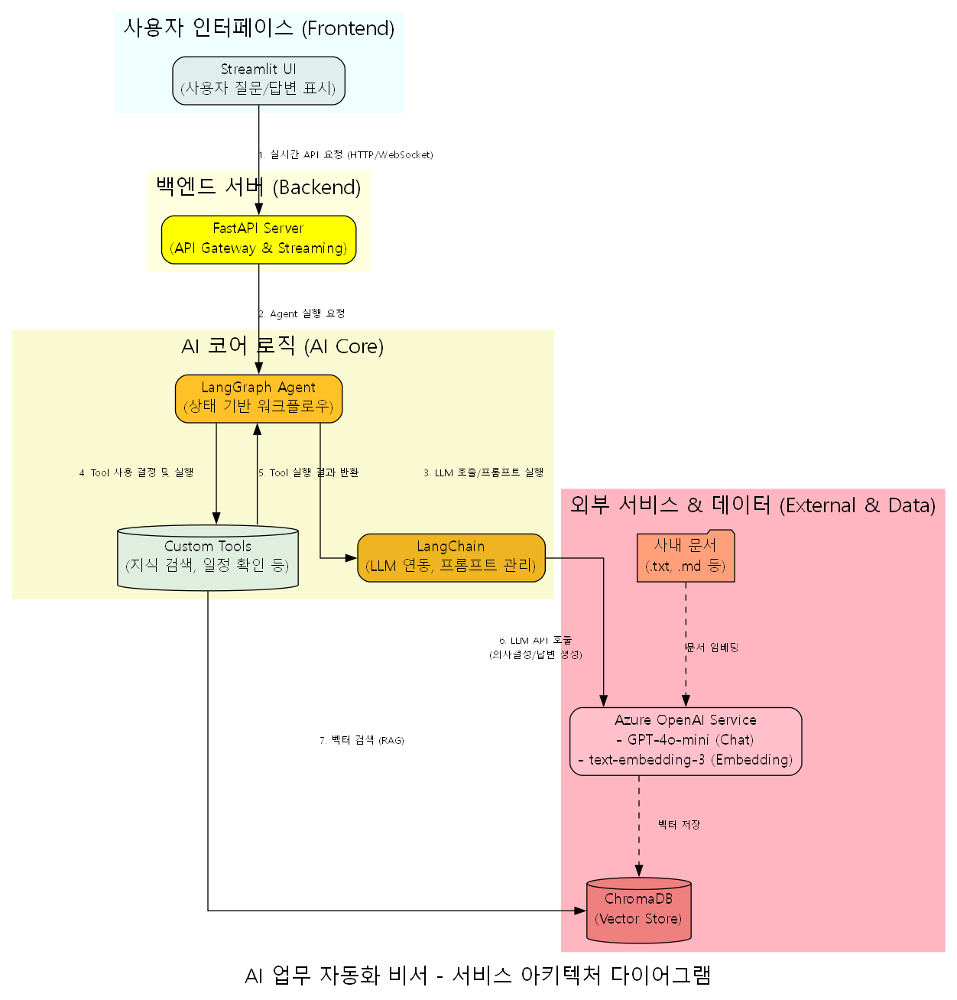
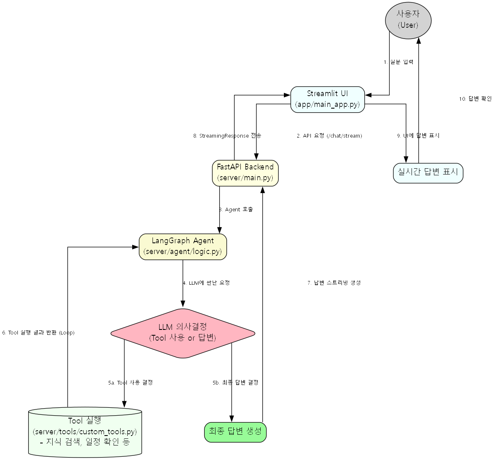

# AI 기반 업무 자동화 비서

## 1. 프로젝트 비전 및 목표

이 프로젝트는 **LangChain, LangGraph, RAG(Retrieval-Augmented Generation)** 기술을 기반으로, 반복적인 사무 업무를 자동화하고 직원의 생산성을 극대화하는 **"AI 업무 자동화 비서"**를 개발하는 것을 목표로 합니다.

단순 정보 검색을 넘어, 이메일 작성, 회의록 요약, 보고서 초안 생성, 사내 지식 기반 질의응답 등 복잡하고 다단계의 업무를 자율적으로 수행하는 지능형 에이전트를 구축하고자 합니다.

---

## 2. 시스템 아키텍처

이 프로젝트는 **프론트엔드(Streamlit)**와 **백엔드(FastAPI)**가 분리된 구조로, 각 서버는 독립적으로 실행됩니다. AI 에이전트는 LangGraph를 통해 여러 도구(Tools)와 상호작용하며 복잡한 작업을 처리합니다.



### 2.1. 프론트엔드 (UI)
- **담당 파일**: `app/main_app.py`
- **역할**: 사용자 인터페이스(UI)를 제공합니다. 사용자가 질문을 입력하고 AI 비서의 답변을 실시간으로 확인할 수 있는 웹 화면을 담당합니다.
- **동작**:
    - 사용자가 질문을 입력하면 백엔드 FastAPI 서버의 `/chat/stream` 엔드포인트로 요청을 보냅니다.
    - 백엔드로부터 스트리밍 형태로 전달되는 답변을 받아 화면에 실시간으로 출력합니다.

### 2.2. 백엔드 (AI Logic & API)
- **담당 파일**: `server/main.py`, `server/agent/logic.py` 등 `server` 디렉토리 하위 파일들
- **역할**: AI 에이전트의 핵심 로직을 처리하고, 프론트엔드에 API를 제공합니다.
- **동작**:
    - FastAPI를 사용하여 `/chat/stream` API 엔드포인트를 제공합니다.
    - 사용자의 질문을 받으면, LangGraph로 구현된 AI 에이전트를 실행하여 답변을 생성하고 스트리밍 형태로 프론트엔드에 전달합니다.

---

## 3. 핵심 기술 스택

- **FastAPI**: 고성능 백엔드 API 서버 구축
- **Streamlit**: 빠른 프로토타이핑 및 데이터 앱 UI 개발
- **LangChain & LangGraph**: LLM 기반의 자율 에이전트 및 복잡한 워크플로우 설계
- **RAG (Retrieval-Augmented Generation)**:
    - **Vector DB**: Qdrant (또는 ChromaDB)를 사용해 내부 문서(`docs` 폴더)를 벡터화하여 저장
    - **Embedding Model**: Azure OpenAI Service의 `text-embedding-3-large` 사용
    - **역할**: LLM이 알지 못하는 사내 지식이나 최신 정보에 대해 정확한 답변을 생성하도록 지원
- **LLM**: Azure OpenAI Service의 `GPT-4o-mini`

---

## 4. AI 에이전트 동작 원리 (LangGraph)

AI 에이전트는 **상태(State)**를 기반으로 노드(Node)와 엣지(Edge)를 따라 이동하며 작업을 수행합니다.



1.  **`agent_node` (LLM 호출)**: 사용자의 질문을 받아 어떤 도구를 사용할지, 또는 바로 답변할지를 결정합니다.
2.  **`should_continue` (조건부 분기)**: LLM의 결정에 따라 `tool_executor` 노드로 이동할지, 아니면 종료할지를 결정합니다.
3.  **`tool_executor` (도구 실행)**: `search_knowledge_base`와 같은 실제 도구를 실행하고 그 결과를 `agent_node`에 다시 전달합니다.
4.  **종료**: 도구 실행 결과까지 종합하여 최종 답변을 생성하고 사용자에게 전달합니다.

---

## 5. 프로젝트 실행 방법

3개의 터미널을 열고 아래 단계를 순서대로 실행합니다.

**1. Vector DB 생성 (최초 1회)**
   `docs` 폴더의 문서를 읽어 벡터 데이터베이스를 생성합니다.
   ```bash
   python -m server.scripts.ingest_data
   ```

**2. 백엔드 서버 실행**
   FastAPI 기반의 AI 로직 서버를 실행합니다.
   ```bash
   uvicorn server.main:app --host 0.0.0.0 --port 8001 --reload
   ```

**3. 프론트엔드 실행**
   Streamlit으로 만든 UI 서버를 실행하면, 웹 브라우저에서 AI 비서와 대화할 수 있습니다.
   ```bash
   streamlit run app/main_app.py
   ```

---

## 6. 향후 개선 및 발전 방향

- **성능 최적화**:
    - **RAG 검색 속도 개선**: 임베딩 모델 교체 및 Vector DB 인덱싱 전략 최적화
    - **문서 전처리 로직 강화**: `ingest_data.py` 스크립트 개선
- **UI/UX 개선**:
    - 사용자 피드백을 반영하여 메인 화면 레이아웃 및 기능 배치 재구성
- **기능 확장**:
    - **이메일 자동화**: 이메일 분류 및 자동 답장 초안 생성 기능 추가
    - **추가 도구 개발**: 캘린더 연동, ERP 데이터 조회 등 업무 자동화 도구 확장
- **안정성 및 신뢰도 강화**:
    - **테스트 코드 도입**: `pytest` 등을 활용한 단위/통합 테스트 작성
    - **지속적인 문서화**: 아키텍처 다이어그램 및 `README.md` 최신 상태 유지